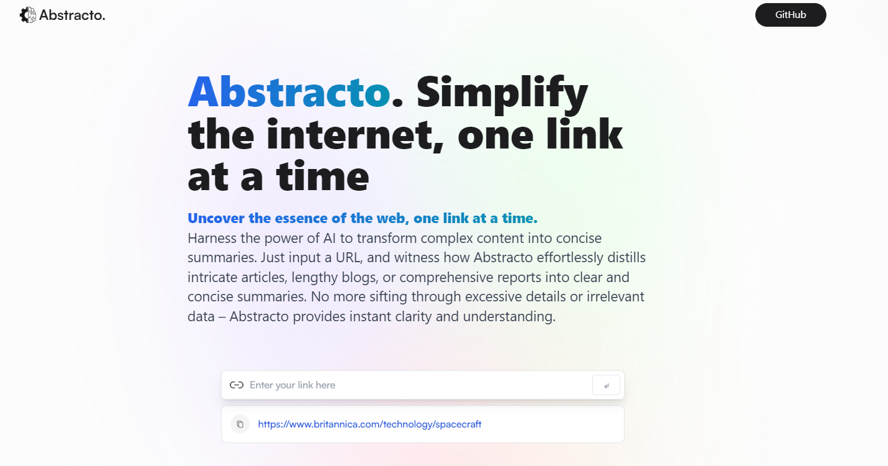

## [Live Demo](https://abstracto.netlify.app/)

## Description

Embark on a journey into the forefront of information processing with Abstracto, a groundbreaking AI-driven tool that's reshaping how we engage with content. As it reshapes complex articles, extensive reports, or lengthy blog posts into concise summaries using just a single URL, Abstracto opens doors to instant clarity and understanding.

Harnessing the capabilities of Rapid API's Article Extractor and Summarizer, Abstracto excels at the art of sifting through a vast array of news articles to unearth and distill the essential points. This formidable API, in tandem with the efficient GPT (Generative Pre-trained Transformer), guarantees the delivery of precise and contextually relevant summaries.

Crafted with React, adorned with the elegance of Tailwind CSS, and powered by Vite, this project stands as a harmonious union of cutting-edge technologies. It's a testament to not only technical expertise but also a firm commitment to developing solutions that prioritize impact and user satisfaction.

## Features

- Extract articles from URLs
- Quickly summarize lengthy content

## Built With

- Rapid API's Article Extractor and Summarizer
- React
- Tailwind CSS
- Redux Toolkit

## Contact

Project maintained by Samarjit Mahi.

- Email: samarjitmahi6245@gmail.com
- Website: [samarmahi](https://samarmahi.netlify.app/)

## Credits & Acknowledgements

Designs inspired by [dub.sh](https://dub.sh)!!
